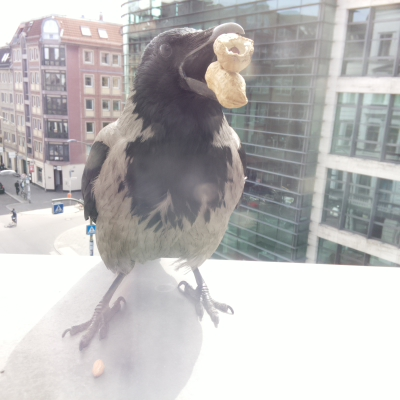

# Crow Detector

This project uses an image classification model trained using Google's Teachable Machine to identify the hooded crow (Nabelkrähe) that visits my window to grab some peanuts. It then tweets their photos if a crow is detected.

Orville the crow pics: https://twitter.com/orvillethecrow

Trained model: https://teachablemachine.withgoogle.com/models/gxgZ2fWAP/

This is using a Teachable Machine model trained on real images of my hooded crow friend and runs in Node.js using tfjs-node.

100% Javascript!

🚨 Note: Runs on RPI4 with these modifications: https://github.com/yhwang/node-red-contrib-tf-model#note

#### To run:

- git clone the repo
- `npm i`
- `node app.js`
